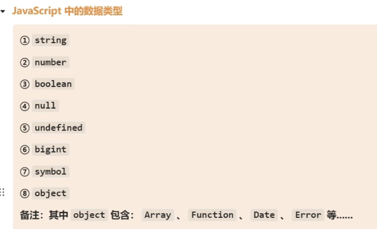
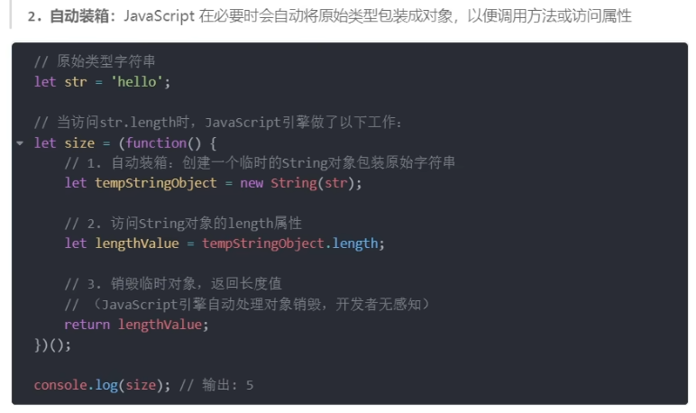

# typescript中的类型特点

1. any类型，声明了any类型的会污染全局，声明了any类型的变量的值可以赋值给任何类型
```ts
let a: any
a = true

let b: string
b = a
console.log(b); // true
```
-   声明了any类型的，可以任意访问属性而不报错
```ts
let a: any
a = "hello"
a.name
```
- any类型有显示any和隐士any，显示any就是直接在变量后面给了any，隐士any是只是声明了一个变量而不给任何类型
2. unknown和any类似但是比any安全些，声明为unknown类型的不能访问任何属性

3. TS中特殊的用法
```ts
let a: "hello"
a = "xxxxx" // 报错
声明了“hello”的只能赋值为“hello”，可以当作常量来用
```
4. Javascript的基本类型



5. TS基本数据类型


6. 在声明类型时的注意点


